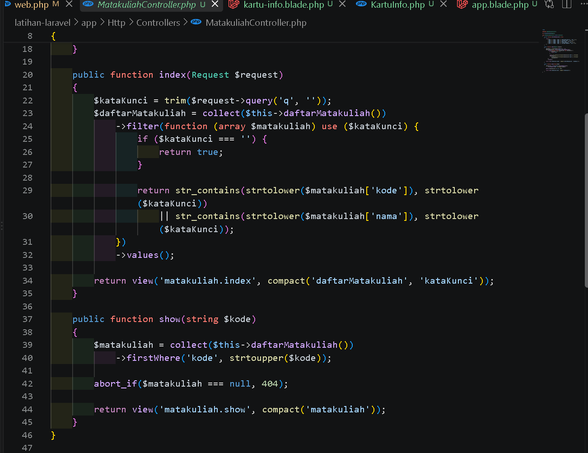
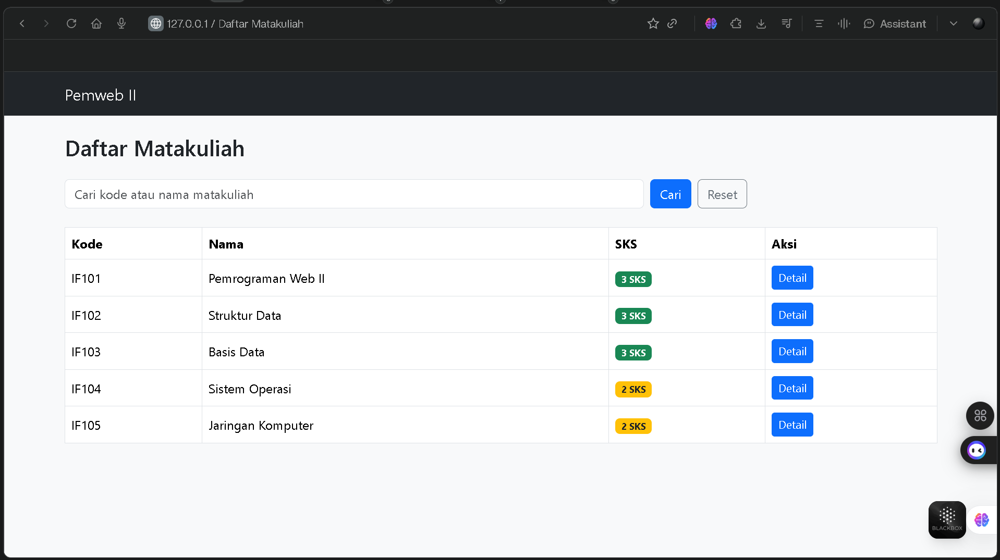
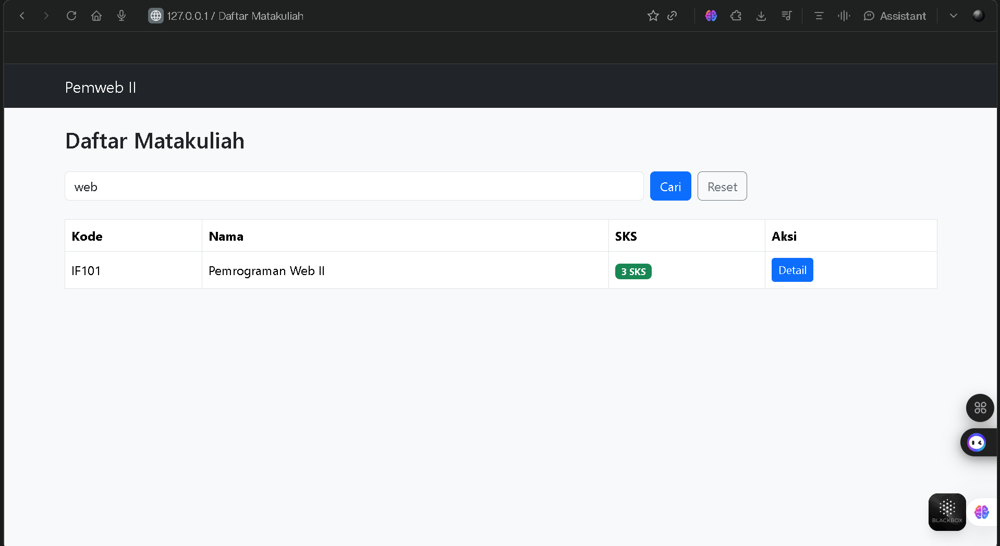
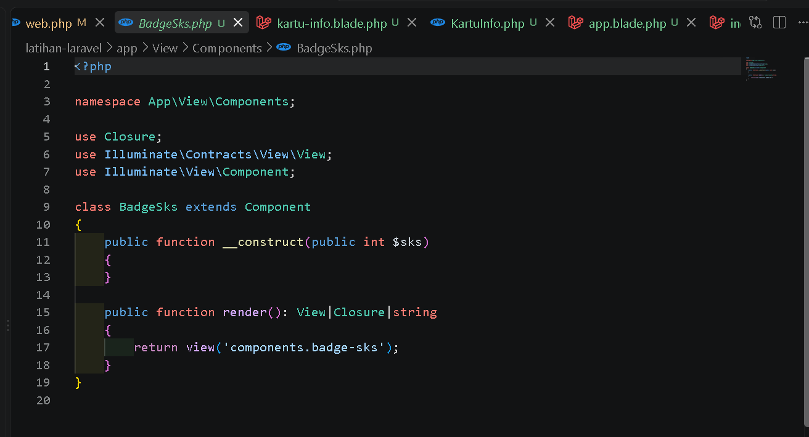

# E. Tugas Praktikum
 
 
### 1. Buat MatakuliahController dengan method index dan show, gunakan data array berisi minimal lima matakuliah dengan atribut kode, nama, dan SKS.
 

 
### 2. Buat view daftar dan detail matakuliah menggunakan layout yang sama.
 

 
### 3. Tambahkan fitur pencarian sederhana pada halaman daftar matakuliah menggunakan query string.

 

 
### 4. Tambahkan komponen Blade baru bernama badge-sks yang menampilkan jumlah SKS dengan warna berbeda untuk SKS di bawah tiga dan tiga ke atas.

 

 
# F. Pertanyaan Pembahasan
 

 
### 1. Apa keuntungan penggunaan nama rute dibandingkan penulisan URL secara literal pada view?

  > Penggunaan nama rute membuat view tidak bergantung langsung pada struktur URL. Jika URL diubah, cukup ubah definisi rutenya tanpa harus mencari dan mengubah semua URL literal di view. Nama rute juga membuat kode lebih mudah dibaca, mengurangi kesalahan penulisan, serta memudahkan pengelolaan tautan menggunakan helper seperti `route()`.

### 2. Jelaskan perbedaan `{{ }}` dan `{!! !!}` pada Blade serta implikasi keamanannya.

  > `{{ }}` digunakan untuk menampilkan data dengan escaping HTML secara otomatis. Karakter khusus seperti `<` dan `>` akan diubah sehingga isi data tidak dianggap sebagai kode HTML atau JavaScript. Karena itu, sintaks ini lebih aman dan sebaiknya digunakan untuk data dari pengguna.
  >
  > `{!! !!}` digunakan untuk menampilkan data tanpa escaping HTML. Sintaks ini dapat dipakai ketika memang ingin merender HTML yang sudah dipercaya, tetapi berisiko menimbulkan serangan XSS jika datanya berasal dari pengguna atau sumber yang tidak tepercaya. Oleh karena itu, `{!! !!}` harus digunakan secara selektif dan hanya setelah data dipastikan aman.

### 3. Mengapa logika pengambilan data sebaiknya tidak diletakkan langsung pada berkas rute?

  > Logika pengambilan data sebaiknya diletakkan pada controller atau lapisan lain yang sesuai, bukan langsung pada berkas rute, agar tanggung jawab setiap bagian aplikasi tetap jelas. Berkas rute cukup menangani pemetaan URL ke controller, sedangkan controller menangani alur permintaan dan pengambilan data. Pemisahan ini membuat kode lebih mudah dibaca, diuji, dipelihara, dan digunakan kembali ketika aplikasi berkembang.