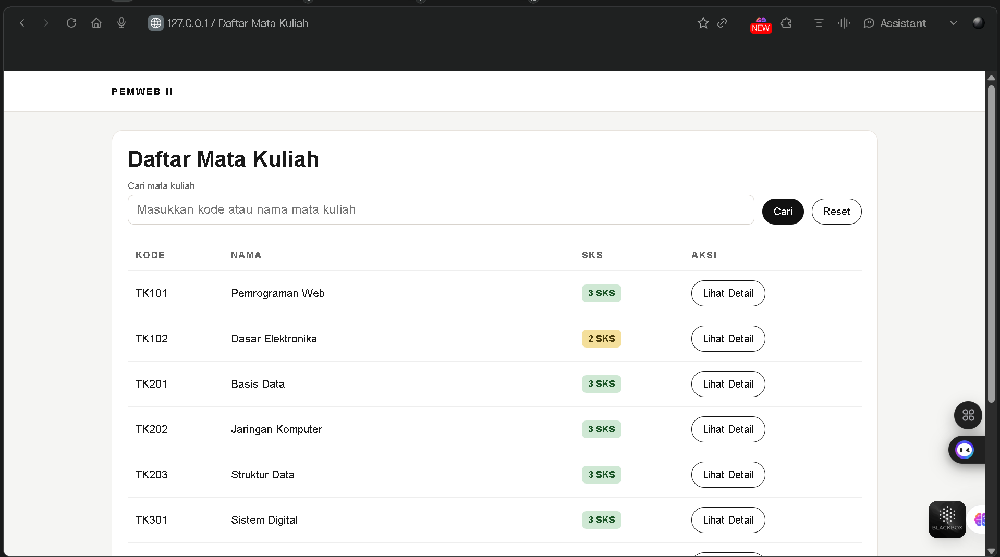
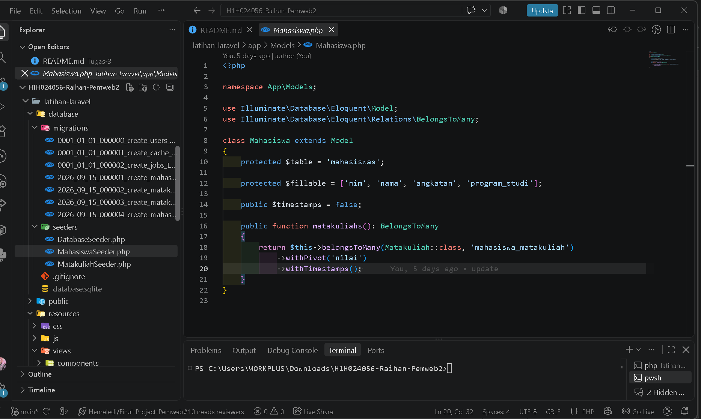
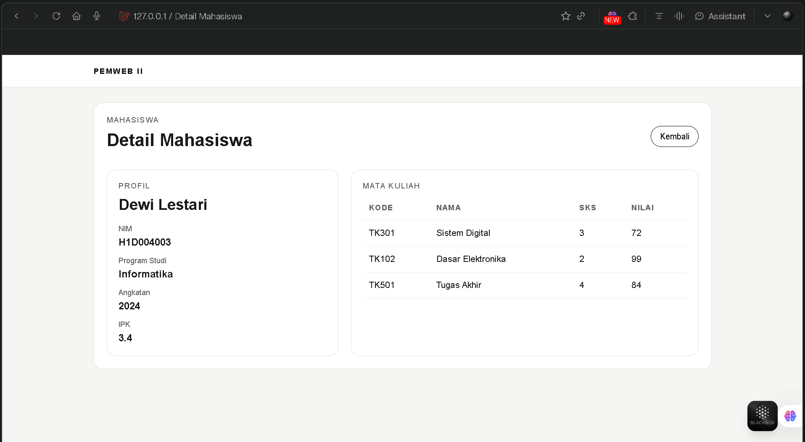
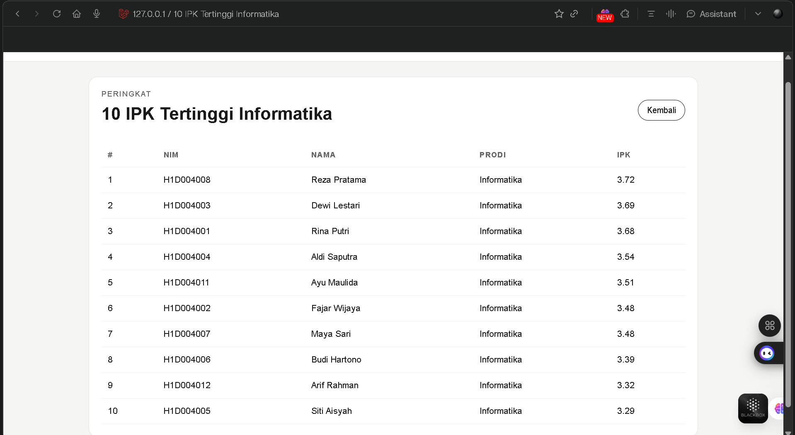

# E. Tugas Praktikum

### 1. Tambahkan tabel `matakuliahs` dengan kolom `kode`, `nama`, `sks`, dan `semester` beserta model dan seedernya.

  >Pada praktikum ini saya membuat migration untuk tabel `matakuliahs`, model `Matakuliah`, dan `MatakuliahSeeder`. Seeder digunakan untuk mengisi data beberapa mata kuliah sehingga data dapat langsung ditampilkan pada halaman Laravel.
  >
  >File yang digunakan:
  >
  >- `latihan-laravel/database/migrations/2026_09_15_000002_create_matakuliahs_table.php`
  >- `latihan-laravel/app/Models/Matakuliah.php`
  >- `latihan-laravel/database/seeders/MatakuliahSeeder.php`
  >
  >Hasil halaman daftar mata kuliah:



### 2. Buat relasi banyak ke banyak antara `mahasiswas` dan `matakuliahs` melalui tabel pivot `mahasiswa_matakuliah` yang memiliki kolom tambahan `nilai`.

  >Relasi banyak ke banyak dibuat menggunakan tabel pivot `mahasiswa_matakuliah`. Satu mahasiswa dapat mengambil banyak mata kuliah, dan satu mata kuliah dapat diambil oleh banyak mahasiswa. Kolom `nilai` pada tabel pivot digunakan untuk menyimpan nilai mahasiswa pada mata kuliah tertentu.
  >
  >File yang digunakan:
  >
  >- `latihan-laravel/database/migrations/2026_09_15_000004_create_mahasiswa_matakuliah_table.php`
  >- `latihan-laravel/app/Models/Mahasiswa.php`
  >- `latihan-laravel/app/Models/Matakuliah.php`
  >- `latihan-laravel/database/seeders/DatabaseSeeder.php`
  >
  >Relasi pada model menggunakan `belongsToMany()` dan `withPivot('nilai')`.



### 3. Tampilkan halaman detail mahasiswa yang memuat daftar mata kuliah yang diambil beserta nilainya.

  >Halaman detail mahasiswa dibuat pada controller `MahasiswaController` dengan eager loading:

```php
$mahasiswa = Mahasiswa::with('matakuliahs')
    ->where('nim', $nim)
    ->firstOrFail();
```

  >Data tersebut dikirim ke view `resources/views/mahasiswa/show.blade.php`. Halaman ini menampilkan identitas mahasiswa, daftar mata kuliah, SKS, nilai, dan IPK dengan skala maksimal 4,0.



### 4. Buat query menggunakan Eloquent untuk menampilkan sepuluh mahasiswa dengan IPK tertinggi pada program studi Informatika.

  >Query dibuat pada method `topIpk()` di `MahasiswaController`. Data mahasiswa disaring berdasarkan program studi Informatika, relasi mata kuliah dimuat dengan `with()`, kemudian nilai rata-rata dikonversi ke skala IPK 4,0, diurutkan dari yang terbesar, dan dibatasi 10 data.
  >
  >Halaman dapat dibuka melalui:

```text
http://127.0.0.1:8000/top-ipk
```



  >Untuk menjalankan dan mengambil screenshot halaman, saya menggunakan perintah berikut dari folder `latihan-laravel`:

```powershell
php artisan migrate:fresh --seed
php artisan serve --host=127.0.0.1 --port=8000
```

  >Link halaman yang didokumentasikan:

  >- http://127.0.0.1:8000/data-mahasiswa
  >- http://127.0.0.1:8000/data-matakuliah
  >- http://127.0.0.1:8000/data-mahasiswa/H1D004001
  >- http://127.0.0.1:8000/top-ipk

# F. Pertanyaan Pembahasan

### 1. Jelaskan fungsi properti `$fillable` dan risiko yang muncul apabila properti tersebut diabaikan.

  >`$fillable` adalah properti pada model Eloquent yang digunakan untuk menentukan kolom mana saja yang boleh diisi melalui mass assignment, misalnya menggunakan method `create()` atau `fill()`. Pada model `Mahasiswa`, properti tersebut berisi kolom yang memang boleh diisi:

```php
protected $fillable = ['nim', 'nama', 'angkatan', 'program_studi'];
```

  >Jika `$fillable` diabaikan, kolom yang tidak seharusnya dapat diubah mungkin ikut terisi dari input pengguna. Hal ini dapat menyebabkan mass assignment vulnerability. Sebagai contoh, pengguna dapat mencoba mengubah kolom sensitif seperti `is_admin`, `role`, atau `status`. Oleh karena itu, `$fillable` penting untuk membatasi data yang boleh masuk ke model dan menjaga keamanan aplikasi.

### 2. Apa perbedaan `migrate:fresh`, `migrate:refresh`, dan `migrate:rollback`?

  >- `migrate:fresh` menghapus semua tabel, kemudian menjalankan seluruh migration dari awal. Perintah ini cocok digunakan saat ingin membuat ulang database secara total, terutama ketika pengembangan dan pengujian.
  >- `migrate:refresh` menjalankan rollback terhadap migration, kemudian menjalankannya kembali. Perintah ini digunakan untuk menyegarkan struktur database tanpa menghapus seluruh file database secara langsung.
  >- `migrate:rollback` membatalkan batch migration terakhir saja. Perintah ini cocok ketika hanya ingin membatalkan perubahan migration yang paling baru.

  >Jadi, `fresh` digunakan untuk mengatur ulang secara total, `refresh` untuk mengembalikan lalu menjalankan migration ulang, sedangkan `rollback` untuk membatalkan migration terakhir.

### 3. Jelaskan masalah N plus 1 beserta cara mengatasinya berdasarkan pengamatan pada Langkah 12.

  >Masalah N plus 1 terjadi ketika aplikasi menjalankan satu query untuk mengambil data utama, kemudian menjalankan query tambahan untuk setiap data ketika mengakses relasinya. Misalnya, aplikasi mengambil 10 mahasiswa dengan satu query, lalu mengambil mata kuliah masing-masing mahasiswa satu per satu. Jumlah query menjadi 1 + 10 query atau lebih, sehingga kinerjanya kurang efisien.
  >
  >Contoh yang dapat menimbulkan N plus 1:

```php
$mahasiswa = Mahasiswa::all();

foreach ($mahasiswa as $data) {
    echo $data->matakuliahs;
}
```

  >Cara mengatasinya adalah menggunakan pemuatan awal (eager loading) dengan `with()`:

```php
$mahasiswa = Mahasiswa::with('matakuliahs')->get();
```