# E. Tugas Praktikum

### 1. Tambahkan endpoint `PUT /api/auth/password` untuk mengubah kata sandi pengguna yang sedang login, dengan verifikasi kata sandi lama.

  >Saya menambahkan endpoint ubah kata sandi yang hanya bisa digunakan setelah login. Sistem memeriksa kata sandi lama sebelum menyimpan kata sandi baru menggunakan hash.
  >
  >File yang digunakan: `latihan-laravel/app/Http/Controllers/Api/AuthController.php` dan `latihan-laravel/routes/api.php`.
  >
  >Berikut cuplikan method dan hasil request `PUT /api/auth/password`:

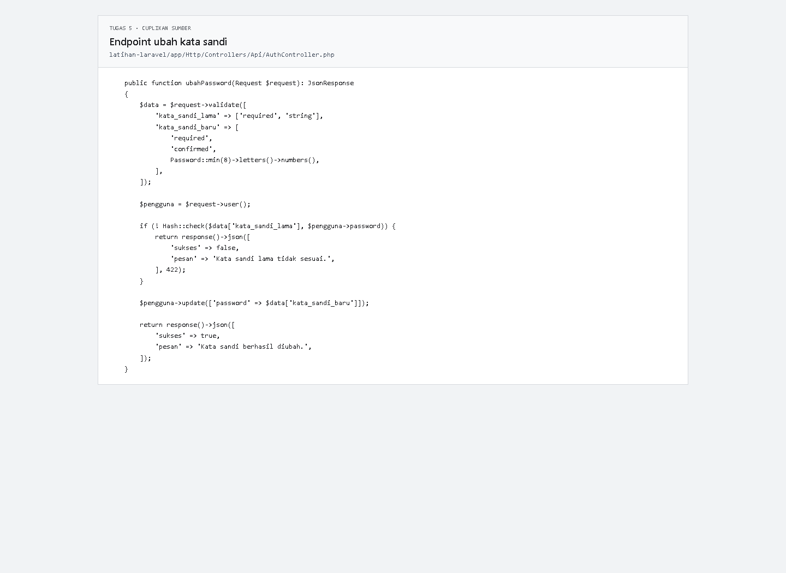

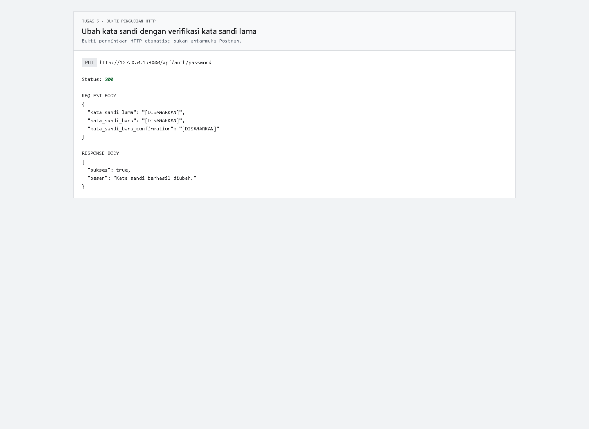

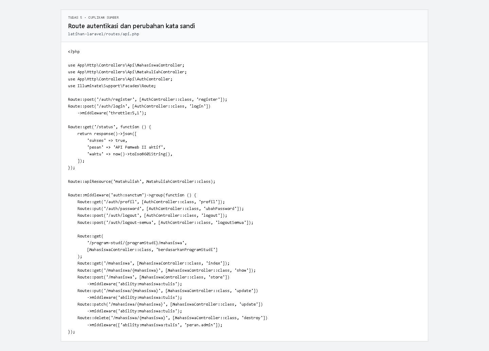

### 2. Buat middleware kustom `PeranAdmin` yang menolak permintaan apabila peran pengguna bukan admin, lalu terapkan pada rute penghapusan mahasiswa.

  >Middleware `PeranAdmin` memeriksa peran pengguna. Route penghapusan mahasiswa juga memeriksa kemampuan token `mahasiswa:tulis`. Dengan demikian, pengguna harus memiliki peran admin dan token yang memiliki kemampuan tulis.
  >
  >File yang digunakan: `latihan-laravel/app/Http/Middleware/PeranAdmin.php`, `latihan-laravel/routes/api.php`, dan `latihan-laravel/bootstrap/app.php`.

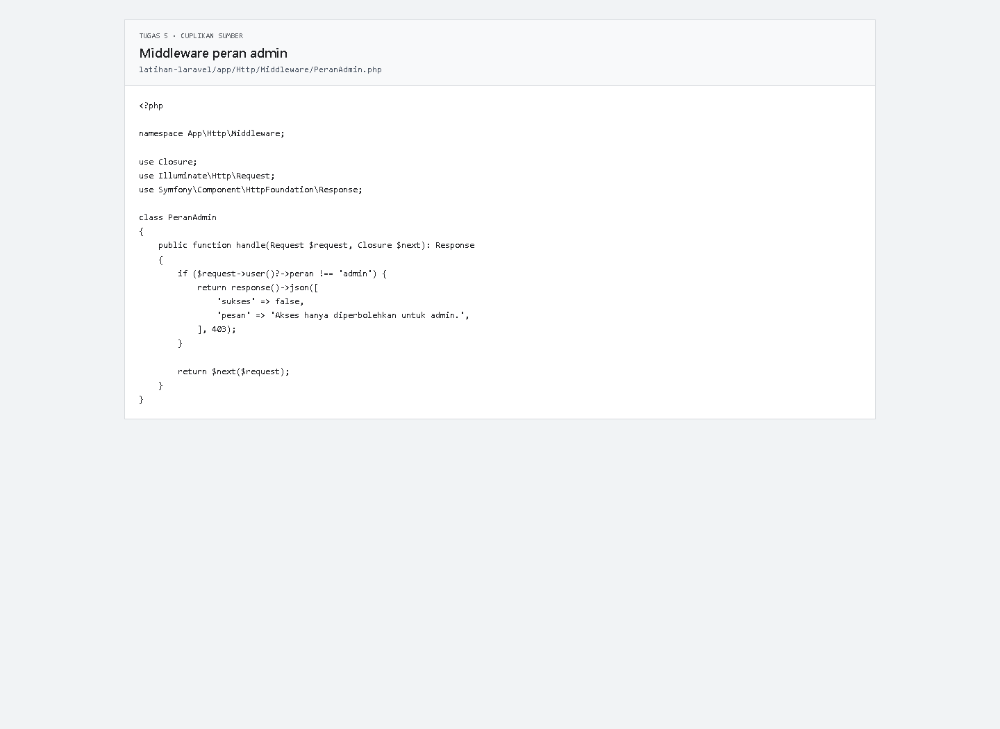

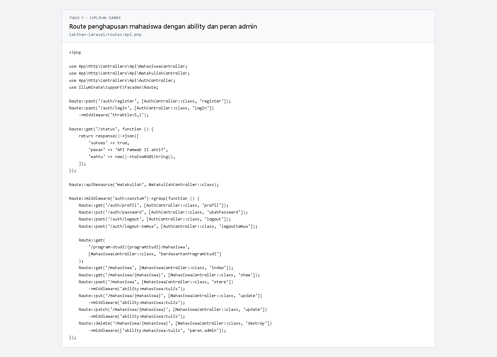

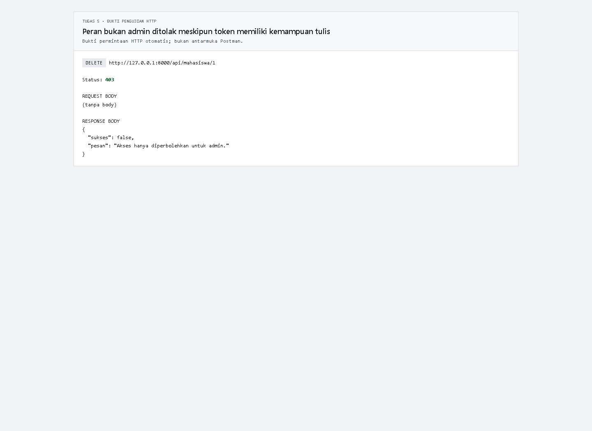

### 3. Tambahkan kolom `terakhir_login` pada tabel `users` dan perbarui nilainya setiap kali login berhasil.

  >Kolom `terakhir_login` dibuat melalui migration dan diperbarui setelah login berhasil. Nilai waktu login dapat dilihat melalui endpoint profil `GET /api/auth/profil`.
  >
  >File yang digunakan: `latihan-laravel/database/migrations/2026_10_05_000001_add_peran_and_terakhir_login_to_users_table.php`, `latihan-laravel/app/Models/User.php`, dan `latihan-laravel/app/Http/Controllers/Api/AuthController.php`.

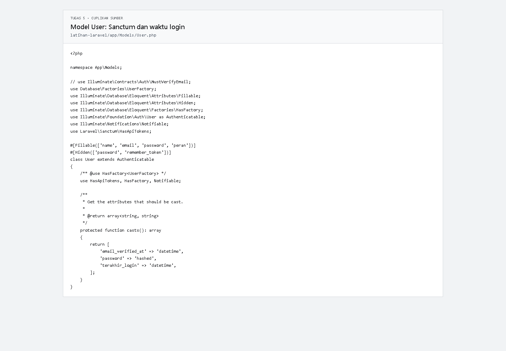

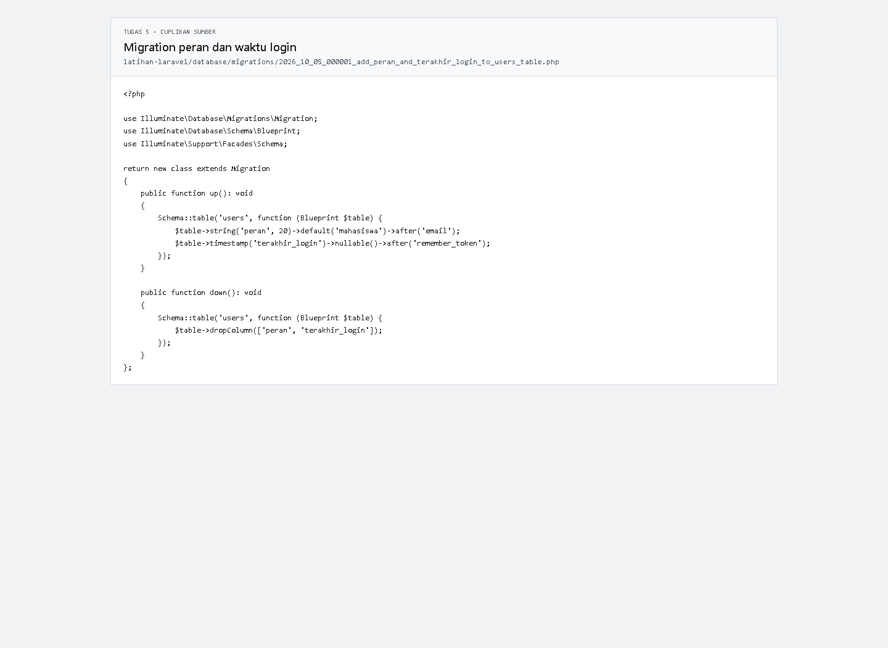

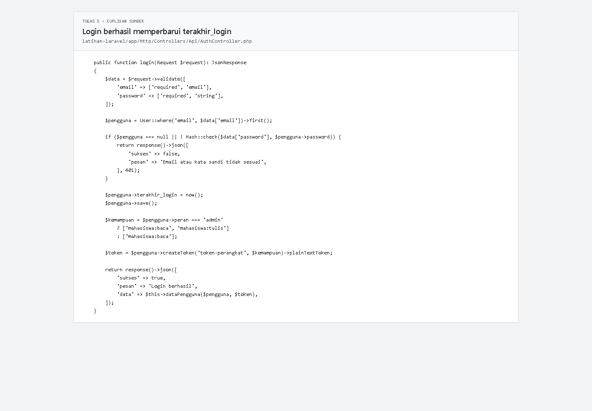

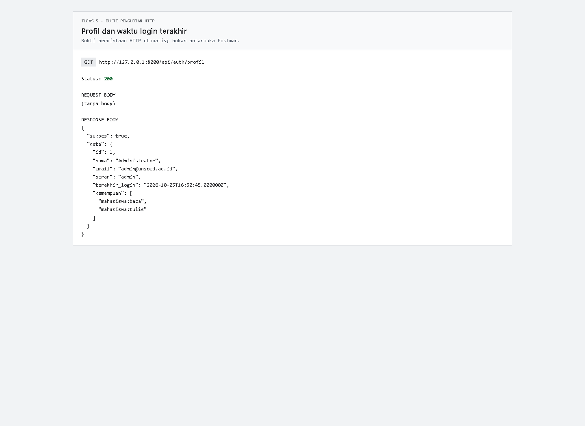

### 4. Buat skenario pengujian yang mencakup login berhasil, login gagal, akses tanpa token, akses dengan token yang sudah dihapus setelah logout, dan akses tanpa kemampuan yang cukup.

  >Skenario API diuji terhadap server Laravel lokal. Token dan kata sandi disamarkan dalam gambar.
  >
  >Akun uji dari seeder:
  >- Admin: `admin@unsoed.ac.id`, kata sandi `rahasia123`.
  >- Mahasiswa: `mahasiswa@unsoed.ac.id`, kata sandi `rahasia123`.
  >
  >Login berhasil menghasilkan token dengan status `200`:

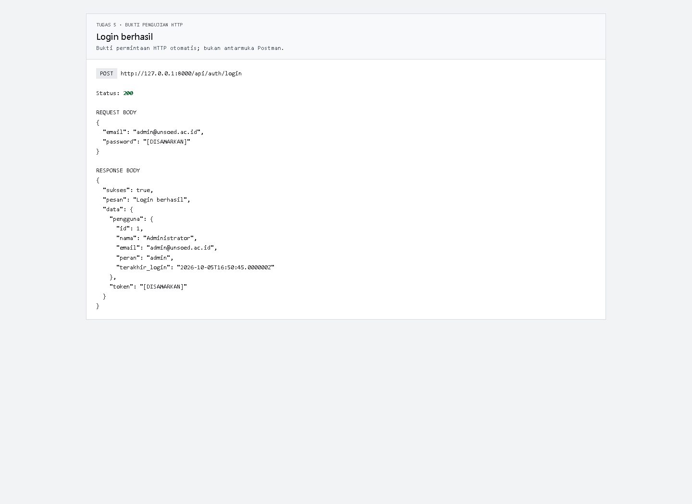

  >Password yang salah menghasilkan status `401`:

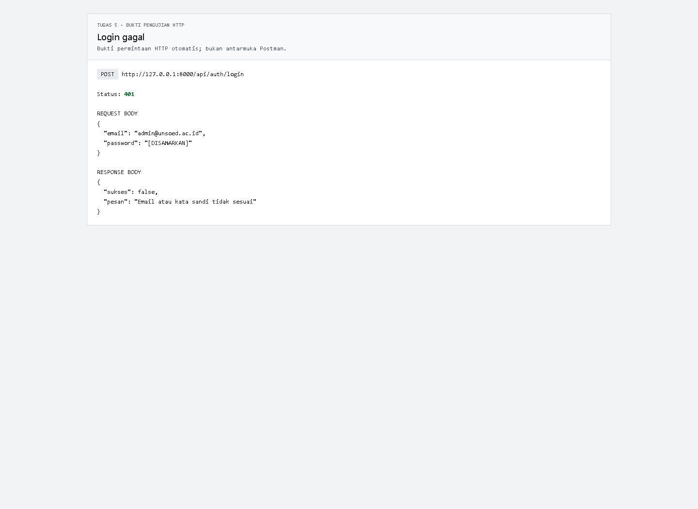

  >Akses profil tanpa header Bearer Token menghasilkan status `401`:

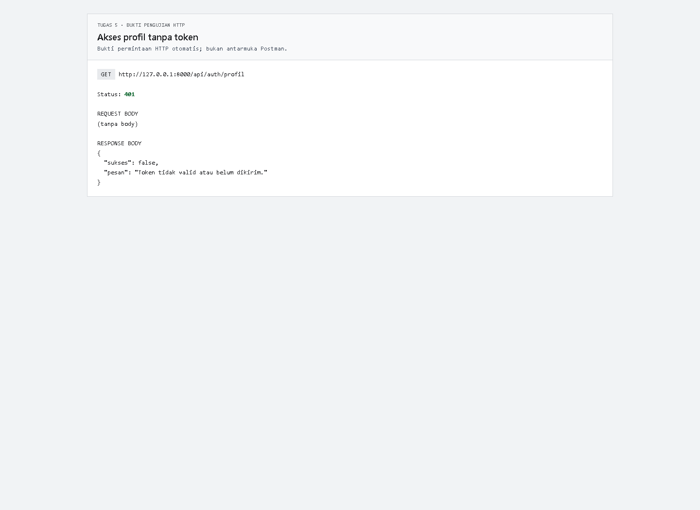

  >Setelah logout, token lama sudah dicabut di server dan tidak dapat dipakai kembali. Akses profil dengan token lama menghasilkan status `401`:

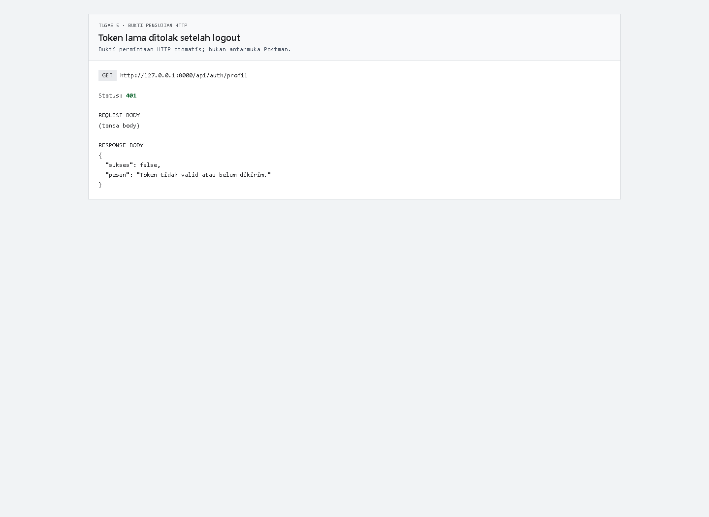

  >Token akun mahasiswa tidak memiliki kemampuan `mahasiswa:tulis`. Karena itu, permintaan untuk menambah mahasiswa ditolak dengan status `403`:

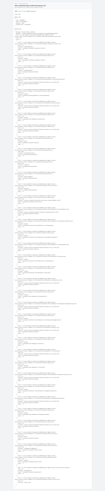

  >Route penghapusan juga menolak pengguna yang bukan admin dengan status `403`, walaupun token uji pengguna tersebut memiliki kemampuan tulis:


  >Catatan: gambar hasil request di atas dibuat otomatis dari respons HTTP API yang sebenarnya menggunakan Playwright; gambar tersebut bukan tangkapan antarmuka Postman. Untuk bukti yang secara khusus harus menampilkan aplikasi Postman, buka request yang sama di Postman dan ambil screenshot manual.

# F. Pertanyaan Pembahasan

### 1. Mengapa kata sandi harus disimpan dalam bentuk hash dan bukan terenkripsi dua arah?

  >Menurut saya, kata sandi disimpan dalam bentuk hash karena aplikasi hanya perlu memeriksa kecocokan kata sandi saat login, bukan membaca kembali kata sandi asli. Hash bersifat satu arah. Jika basis data bocor, kata sandi tidak langsung dapat dibaca seperti data yang dienkripsi dua arah.
  >
  >Enkripsi dua arah dapat dibuka kembali dengan kunci. Jika kuncinya bocor, kata sandi asli dapat diketahui. Karena itu, kata sandi lebih tepat disimpan memakai hash khusus seperti bcrypt atau Argon2. Pada project ini, Laravel meng-hash kata sandi melalui cast `password` bertipe `hashed` pada model `User`.

### 2. Apa perbedaan antara kemampuan token pada Sanctum dan peran pengguna pada tabel `users`?

  >Kemampuan token adalah izin yang melekat pada token tertentu, misalnya `mahasiswa:baca` atau `mahasiswa:tulis`. Satu pengguna dapat mempunyai token-token dengan kemampuan yang berbeda.
  >
  >Peran adalah kategori pengguna yang disimpan pada tabel `users`, misalnya `admin` atau `mahasiswa`. Pada project ini middleware `PeranAdmin` memeriksa peran, sedangkan middleware Sanctum memeriksa kemampuan token.
  >
  >Jadi, peran menunjukkan siapa penggunanya, sedangkan kemampuan menunjukkan tindakan yang diizinkan untuk token tersebut. Untuk menghapus mahasiswa, keduanya harus sesuai.

### 3. Jelaskan risiko penyimpanan token pada `localStorage` peramban serta alternatif yang lebih aman.

  >Token di `localStorage` dapat dibaca oleh JavaScript. Jika aplikasi terkena serangan XSS, script berbahaya dapat mencuri token dan menggunakannya untuk mengakses API sebagai pengguna.
  >
  >Alternatif untuk aplikasi SPA adalah cookie Sanctum dengan atribut `HttpOnly`, `Secure`, dan `SameSite`, disertai perlindungan CSRF. Cookie `HttpOnly` tidak dapat dibaca JavaScript biasa. Pada aplikasi mobile, token sebaiknya disimpan di penyimpanan kredensial aman milik sistem operasi. Token juga tidak boleh dikirim lewat query string atau ditulis ke log.

### 4. Mengapa endpoint logout perlu menghapus token di sisi server padahal token disimpan pada klien?

  >Menghapus token dari penyimpanan klien saja tidak menjamin semua salinannya hilang. Token mungkin sudah tersalin atau masih digunakan dari perangkat lain. Selama token tercatat di tabel `personal_access_tokens`, server tetap dapat menerimanya.
  >
  >Endpoint logout menghapus token aktif di server melalui `currentAccessToken()->delete()`. Setelah itu token lama tidak berlaku lagi meskipun masih ada salinannya. Jadi, logout perlu mencabut token di server, bukan hanya membersihkan token di klien.

## Menjalankan Project dan Mengambil Screenshot

Jalankan perintah berikut dari folder `latihan-laravel`:

```powershell
php artisan migrate:fresh --seed
php artisan serve --host=127.0.0.1 --port=8000
```

Screenshot halaman web Tugas-4 tersimpan di folder `Tugas-4`:

- `01-data-matakuliah.png`
- `02-relasi-many-to-many.png`
- `03-detail-mahasiswa.png`
- `04-top-ipk.png`

Screenshot kode dan hasil API Tugas-5 tersimpan bersama README ini. Token dan kata sandi sudah disamarkan pada gambar hasil API.
